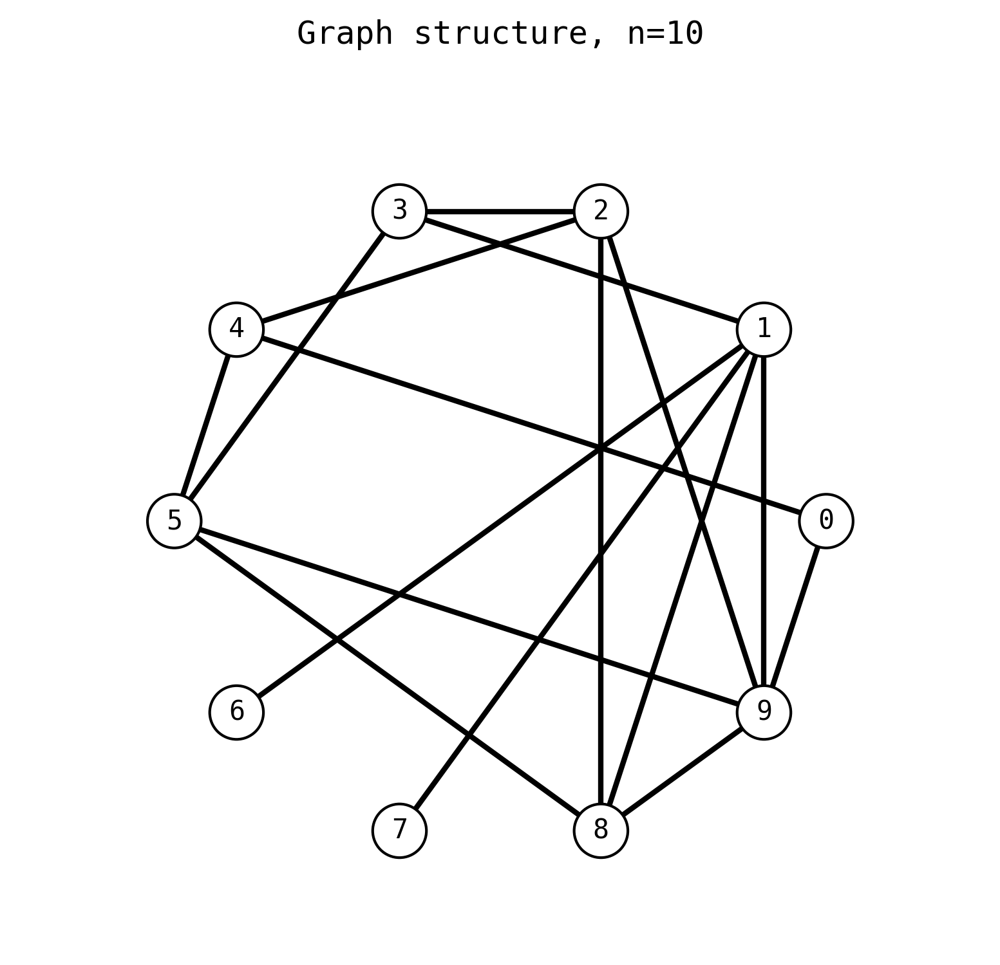
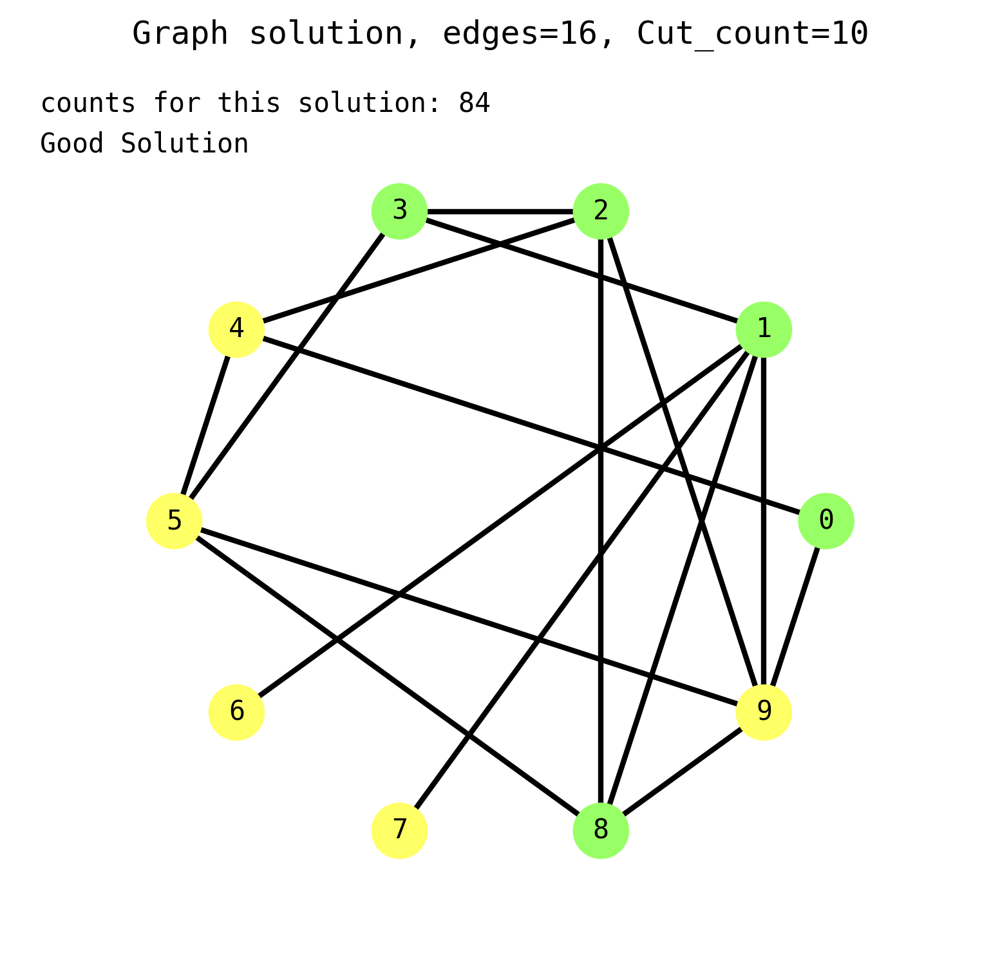
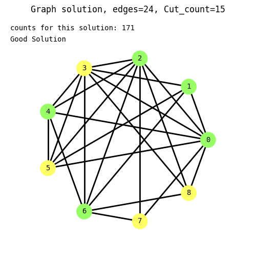

# Easy grover
Everything related to grover search algorithm for quantum computations

A collection of tools designed to automate quantum circuit creation for solving problems described below.
Solutions are made in ``qiskit`` library.

Recently I added another tool to the toolbox, which draws a graph structure with the use of ``matplotlib``.
One can pass a solver instance directly for automatic solution selection and drawing!

### some information about graph coloring problem

a subset of problems concentrated around graph structure partitioning. 
Can be useful in partitioning datasets, some problems related to looking at layout differences.
This type of approach also has a connection to traveling salesman problem.

For now, in this library, automated graph coloring is realised in a fashion of 2-cut algorithm, with simple 
addition being required to count edges connected by nodes with color mismatch. So far implementation only 
includes a stiff edge counting that is compared with a single value.

##### Possible TODO's

1. Restriction to check against single edge sum can be extended to any bracket. For example solutions that allow edges 
   to signify connections between nodes of the same color can be allowed. In that case, it might be useful to 
   check a couple different values. We might construct a problem that reflects an example of "allow more 
   than 25 cuts to be performed", lets say, on a graph with a total of 30 connections between nodes.
2. Different types of initialization can be performed to lower potential need for additional q-bits or save on toffoli 
   complexity of the end circuit.
3. (some things already implemented!) Potential q-bit reuse and optimizations, like usage of different 
   gate combinations to achieve lower running costs on actual quantum computers.
4. Forming a solution in a different library, like ```cirq``` to boost the effectiveness of the algorithm and ease
   compilation of the solution on different quantum computer brands (like Google, IBM, D-Wave and such...)
5. Extending the automation tools for creating circuits to solve a k-cut problem - variable number of colors a 
   graph represents
6. Functions that let one schedule jobs in actual IBM cloud on an actual quantum computer!

### Usage

Typical usage of the library is presented below:

To solve a coloring problem for a graph, you need to prepare a list of pairs that represent a graph structure,
number of nodes, then decide how many edges need to be cut. Only equality operand is supported now, meaning solution 
will only present graph coloring for the matching number of cuts in the graph structure.

```python
from graph_coloring import circuit_constructor

graph_nodes = 3
edges = [(0, 1), (1, 2)]
graph_cutter = circuit_constructor.Graph2Cut(
    nodes=graph_nodes,
    edge_list=edges,
    cuts_number=len(edges),
    condition="="
)
```

Next, you can run a circuit construction procedure. Keep in mind that usually you could min-max probability of 
finding a proper coloring solution. Here you can do this by appropriately choosing number of iterations an oracle 
querry paired up with grover diffusion has to be invoked. Address this by changing ``diffusion_iterations`` parameter, 
then run your circuit.

```
graph_cutter.construct_circuit(diffustion_iterations=2)
# schedule_job_locally runs 'qasm_simulator' type of job on your PC
results = graph_cutter.schedule_job_locally()
print(results)

# you could also use this monstrosity:
# print(sorted([(ans, results[ans]) for ans in results], key=lambda x: x[1])[::-1])
```

Member of an object -> ``graph_cutter.circuit`` has all the gate operations needed for it to be run, so 
one could run it using different simulator or send it to cloud. Alternatively one could also look at its graphical 
representation, though some more complicated designs may not be visualized correctly in mpl (or look absolutely 
atrocious as text).

### update

Since it is now possible to visualize a graph itself, you could enhance the pipline by just
extending it by appending 2 lines at the end of your script. You could do in a way similar to the one presented below:

```python
from graph_coloring import circuit_constructor, graph_visualizer

nodes_ = 10
edges = [[1, 9], [4, 5], [2, 8], [3, 5], [1, 3], [0, 9], [2, 9],
          [5, 9], [1, 8], [0, 4], [2, 3], [2, 4], [8, 9], [5, 8], [1, 6], [1, 7]]

solver = circuit_constructor.Graph2Cut(
   nodes_, edges, cuts_number=len(edges)-6, optimization='qbits')
solver.solve(shots=10000, diffusion_iterations=1)
solver.solution_analysis()

visualiser = graph_visualizer.Graph2CutVisualizer(graph_solver=solver)
visualiser.draw_graph(present_solution=True, select_good=True, draw_type="circle")
```

It is also possible to draw the graph itself, without the need to solve it. You could do something along the 
lines of the code below:

```python
from graph_coloring import graph_visualizer

nodes_ = 10
edges = [[1, 9], [4, 5], [2, 8], [3, 5], [1, 3], [0, 9], [2, 9],
          [5, 9], [1, 8], [0, 4], [2, 3], [2, 4], [8, 9], [5, 8], [1, 6], [1, 7]]


visualiser = graph_visualizer.Graph2CutVisualizer(nodes=nodes_, edge_list=edges)
visualiser.draw_graph(draw_type="circle")
```

### Results

graph structure from above:



solution visualisation for the graph above (n=10, cut=10)



couple other solutions:

```python
nodes = 7 
edges = [
    (4, 2), (2, 6), (6, 3), (3, 0), (0, 5), 
    (5, 1), (5, 4), (2, 1), (3, 4), (5, 6)
]
cuts = 10
```


```python
nodes_ = 9
edges = [
  (1, 5), (5, 4), (4, 6), (6, 3), (3, 8), 
  (8, 0), (0, 7), (7, 2), (2, 4), (8, 2), 
  (6, 1), (3, 2), (3, 0), (8, 6), (3, 5), 
  (5, 0), (0, 2), (0, 1), (5, 2), (0, 4), 
  (2, 6), (7, 6), (3, 4), (1, 3)
]
cuts = len(edges)-9
```


